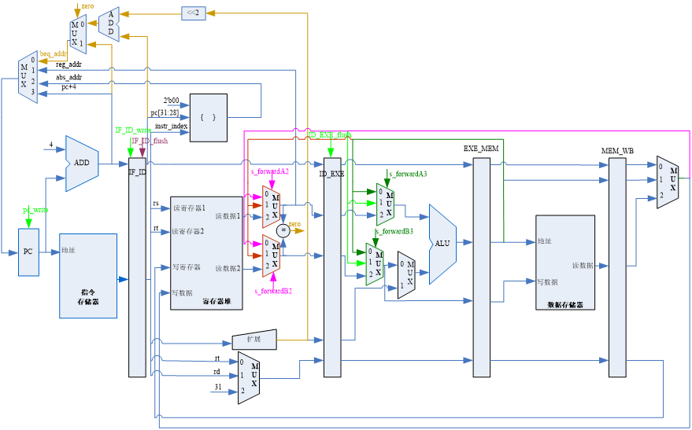

# 单周期指令CPU

[单周期CPU设计](./s_cycle_cpu/)

支持R型指令的单周期CPU

- 32位MIPS R型指令
- 支持addu，subu，add，and，or，slt指令

实现基本模块

- pc模块（程序计数器）
- im模块（指令存储器）
- gpr模块（通用寄存器）
- alu模块（算术逻辑单元)

连接基本模块，实现能够执行addu指令的单周期CPU。

数据通路

# 五级流水线CPU 

[五级流水线CPU设计](./pipeline/)

流水线图

数据通路

